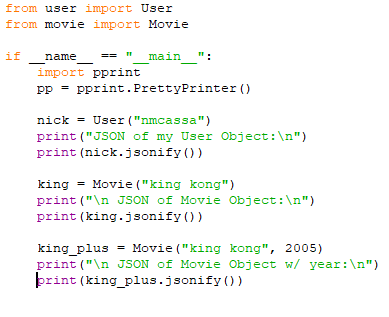

# letterboxdpy

[](https://badge.fury.io/py/letterboxdpy)

## Installation
```
    pip install letterboxdpy
```

## **Example of Movie Object**


## **Example of User Object**


### **Code used for above**



